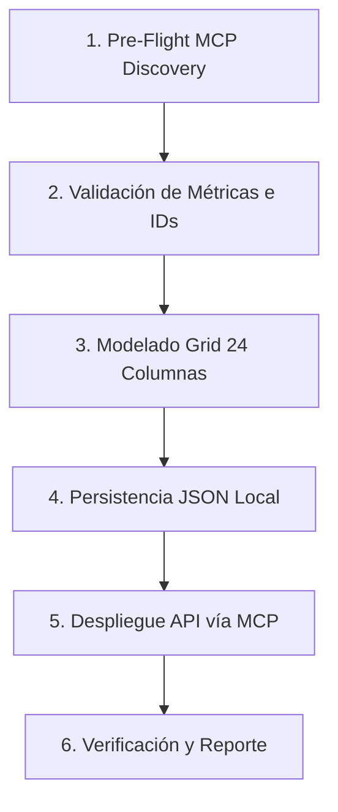

# Workflow: /nuevo-dashboard <servicio>

Este workflow estandariza la creación y actualización de tableros de control en Zabbix 7.0 LTS para Milicic, aplicando de manera determinista las convenciones de `zabbix-dashboard-architect` y el checklist pre-flight con el servidor MCP.

---

## Invocación

```text
/nuevo-dashboard <servicio>
```
Ejemplos:
- `/nuevo-dashboard redes`
- `/nuevo-dashboard servidores-prod`
- `/nuevo-dashboard vmware`
- `/nuevo-dashboard firewalls`
- `/nuevo-dashboard ups`
- `/nuevo-dashboard sql`

---

## Parámetros y Mapeo de Servicios

| Servicio Solicitado | Tags Asociados | Host Groups Sugeridos | Plantillas Típicas | Métricas Core |
| :--- | :--- | :--- | :--- | :--- |
| **`redes`** | `team: redes`, `tier: core`/`access` | `Core_Switches`, `Distribution_Switches`, `Access_Switches` | `Dell N-Series by SNMP`, `HP Comware HH3C` | In/Out Octets (bps), OperStatus, Discards, CPU util, Temp |
| **`servidores-prod`**| `team: plataforma`, `component: server` | `Windows_Server`, `Linux_Server` | `Windows by Zabbix agent 2`, `Linux by Zabbix agent` | CPU util, Memory util, Disk % used (`/`, `C:`), Uptime |
| **`vmware`** | `tier: virtualization` | `Virtualization` | `VMware by HTTP` | CPU/RAM por host ESXi, Datastore used %, Cluster status |
| **`firewalls`** | `component: firewall`, `tier: perimeter` | `Firewall` | `FortiGate by SNMP`/`HTTP` | Sesiones activas, túneles VPN IPsec, SD-WAN Jitter/Loss |
| **`ups`** | `component: ups`, `tier: facilities` | `UPS` | `Template Network Generic Device by SNMP` | Carga % (`upsOutputPercentLoad`), Minutos batería, Tensión |
| **`sql`** | `team: dba`, `component: database` | `Bases_de_Datos`, `Windows_Server` | Windows Agent + SQL items | CPU, Memoria, IOPS disco, Estado servicio MSSQL |

---

## Fases del Workflow



### Fase 1: Pre-Flight MCP Discovery (Checklist Obligatorio)
Antes de construir el JSON del dashboard:
1. **Consultar Hosts:**
   ```json
   {
     "ServerName": "zabbix",
     "ToolName": "host_get",
     "Arguments": {
       "filter": { "status": 0 },
       "tags": [{ "tag": "team", "value": "<team>" }],
       "output": ["hostid", "host", "name"]
     }
   }
   ```
2. **Validar Existencia de Ítems Core:**
   - Usar `item_get` filtrando por `hostids` o `search: { "key_": "..." }`.
   - Confirmar que los ítems tienen `status: "0"` (habilitado) y `state: "0"` (soportado).
3. **Validar Existencia de Mapas SVG:**
   - Si se incluye un mapa, ejecutar `map_get` para confirmar su `sysmapid` (ej. 11 para `NOC Infraestructura`).
4. **Si se actualiza un dashboard existente:**
   - Consultar el dashboard previo con `dashboard_get` (con `selectPages: "extend"`).
   - Respaldar el JSON en `.zabbix_context/dashboards/backup_<id>.json`.

---

### Fase 2: Modelado del Grid de 24 Columnas

Aplicar la estructura de filas sin colisiones:

1. **Fila 0 (y=0, h=4) - Fila de KPIs y Estado:**
   - 4 widgets de valor puntual (`item`) de ancho 4 cada uno (CPU media, memoria, estado general, etc.).
   - 1 widget de problemas (`problems`) o honeycomb de ancho 8, con `show_suppressed = 0` y severidad mínima `Average` (3).
2. **Fila 1 (y=4, h=8) - Fila Operativa Principal:**
   - Opción A: Mapa de red (`svghst`/`map`) de ancho 10 o 12.
   - Opción B: Gráficos vectoriales core (`svggraph`) de ancho 12 o 14 (ej. Tráfico agregado o carga de CPU de hipervisores/core).
3. **Fila 2 (y=12, h=6) - Telemetría Detallada:**
   - 2 o 3 gráficos vectoriales (`svggraph`) de ancho 8 o 12 con métricas de detalle (latencia, IOPS, memoria desglosada).

---

### Fase 3: Persistencia JSON Local

1. Guardar la especificación en:
   `.zabbix_context/dashboards/<servicio>_dashboard.json`
2. Validar que:
   - Para cada widget: `x + width <= 24`.
   - Los campos `fields` correspondan a los tipos de Zabbix 7.0 (`0`=int, `1`=str, `2`=host/item ID).

---

### Fase 4: Despliegue vía MCP Server

1. Ejecutar la llamada a Zabbix MCP:
   - Para crear nuevo: `dashboard_create`
   - Para actualizar existente: `dashboard_update`
2. Comprobar que la respuesta devuelva exitosamente `dashboardids`.

---

### Fase 5: Verificación y Reporte al Usuario

1. Ejecutar `dashboard_get` sobre el `dashboardid` devuelto para confirmar integridad.
2. Presentar al usuario un resumen conciso:
   - Nombre del dashboard y `dashboardid`.
   - URL de acceso directo:
     `https://zabbix.mlccnet.local/zabbix.php?action=dashboard.view&dashboardid=<id>`
   - Detalle de widgets configurados y métricas pre-flight validadas.
   - Enlace al archivo JSON de respaldo en `.zabbix_context/dashboards/`.
