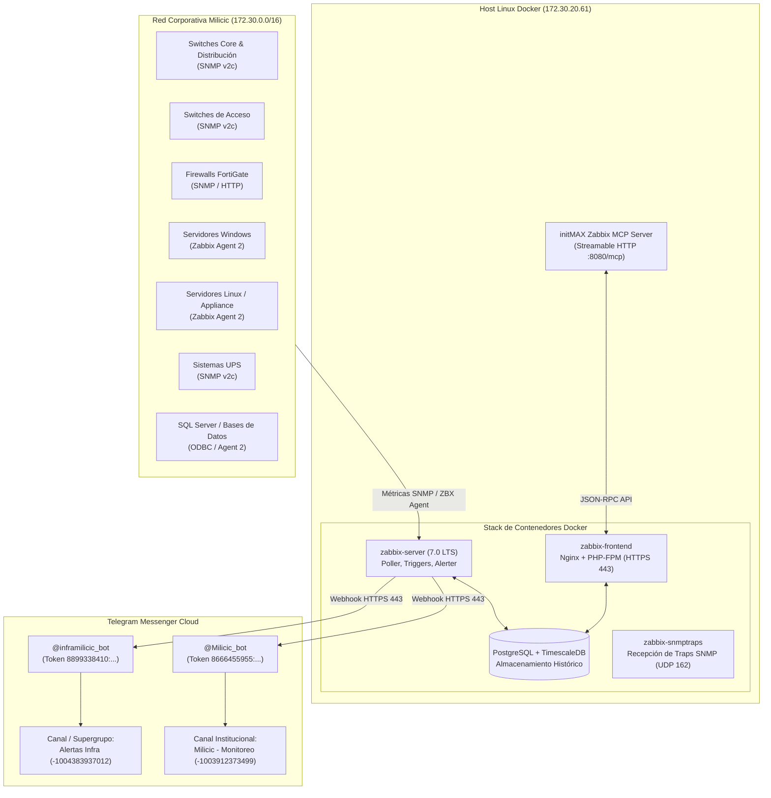

# Arquitectura Técnica e Infraestructura: Zabbix 7.0 LTS (Milicic)

- **Plataforma:** Zabbix Enterprise Monitoring Platform
- **Versión:** 7.0 LTS
- **Entorno:** Producción (`prod`)
- **Organización:** Milicic S.A.
- **Última Actualización:** Septiembre 2026

---

## 1. Visión General y Objetivos de la Infraestructura

La plataforma Zabbix de Milicic centraliza la observabilidad, métricas operativas y gestión de incidentes para toda la infraestructura corporativa, incluyendo switches de Core y Acceso, Firewalls perimetrales, Hipervisores (Hyper-V / VMware ESXi), Servidores físicos y virtuales (Windows / Linux), Bases de Datos (Microsoft SQL Server) y Sistemas de Energía Ininterrumpida (UPS).



---

## 2. Especificación Técnica del Host y Contenedores

### 2.1. Host Base
* **Dirección IP:** `172.30.20.61`
* **Sistema Operativo:** Linux Enterprise / Ubuntu LTS x86_64
* **Dominio Interno:** `mlccnet.local`
* **URL de Acceso Web:** [`https://zabbix.mlccnet.local`](https://zabbix.mlccnet.local)
* **Acceso de Administración:** SSH en puerto 22 (`root@172.30.20.61`), autenticado exclusivamente por clave asimétrica Ed25519 (`C:\claves\id_ed25519_zabbix`).

### 2.2. Despliegue en Docker
Los servicios residen desacoplados en contenedores Docker orquestados:
1. **`zabbix-server`:**
   - Procesa los pollers de agente, SNMP, ICMP pinger, procesador de history/trends y motor de triggers.
   - Ejecuta los webhooks JavaScript en hilos dedicados de `alerter`.
   - Puerto de escucha interna: `10051/TCP`.
2. **`zabbix-frontend`:**
   - Servidor web Nginx con PHP-FPM 8.2+.
   - Expone la interfaz gráfica protegida con certificado SSL/TLS interno en puerto 443.
   - Provee el endpoint JSON-RPC en `/api_jsonrpc.php`.
3. **`zabbix-db` (PostgreSQL con TimescaleDB):**
   - Motor de persistencia relacional y de series de tiempo.
   - Optimizado con compresión automática en chunks de 7 días para métricas numéricas (`history`, `history_uint`) y tablas de tendencias (`trends`, `trends_uint`).
4. **`zabbix-snmptraps`:**
   - Demonio SNMP Trap handler escuchando en `162/UDP` para eventos asíncronos de switches y firewalls.

---

## 3. Topología de Red y Conectividad

* **Red de Gestión:** `172.30.0.0/16`.
* **Ruteo:** El servidor Zabbix alcanza todos los segmentos de sedes (Rosario, San Juan, faenas y obradores remotos) a través del Core de Red y túneles VPN IPsec establecidos por los FortiGates.
* **Firewalling y Puertos Requeridos:**
  - `10050/TCP`: Desde el Zabbix Server hacia los hosts con Zabbix Agent (Passive checks).
  - `10051/TCP`: Desde agentes activos (Active checks) y proxies hacia el Zabbix Server.
  - `161/UDP`: Consultas SNMP desde el Zabbix Server hacia dispositivos de red.
  - `162/UDP`: Traps SNMP enviados hacia el servidor Zabbix.
  - `443/TCP (Saliente)`: Acceso a `api.telegram.org` para el envío de alertas mediante webhooks.

---

## 4. Arquitectura de Integración con Telegram

Zabbix 7.0 utiliza el motor interno de JavaScript (`Duktape`) para ejecutar llamadas asíncronas vía `HttpRequest()` hacia la API REST de Telegram (`https://api.telegram.org/bot<TOKEN>/sendMessage`).

### 4.1. Canales y Bots Configurados

| Canal en Telegram | Tipo | Chat ID | Bot Asociado | Media Type en Zabbix | Destinatarios |
| :--- | :--- | :--- | :--- | :--- | :--- |
| **Alertas Infra** | Supergrupo | `-1004383937012` | `@inframilicic_bot`<br>`8899338410:AAHP9R...` | `Telegram_Test` (ID: 71) | Administradores, Guardias SRE/NOC |
| **Milicic - Monitoreo** | Canal | `-1003912373499` | `@Milicic_bot`<br>`8666455955:AAHYjk...` | `Telegram_Test_Milicic` (ID: 72) | Grupo gerencial, monitoreo transversal |

### 4.2. Flujo de Procesamiento del Webhook
1. El trigger cambia de estado (`PROBLEM` o `RESOLVED`).
2. La **Action** evalúa las condiciones (severidad, tags, supresión por mantenimiento).
3. Si coincide, genera una operación para el grupo de usuarios receptor.
4. Zabbix verifica los **Medias activos** de cada usuario del grupo y sus permisos de lectura sobre el host.
5. El proceso `alerter` ejecuta el script del webhook, armando el payload en formato HTML/Markdown:
   ```json
   {
     "chat_id": "-1003912373499",
     "text": "INCIDENTE CRÍTICO\nHost: SRO-SW-CORE01\n...",
     "parse_mode": "html",
     "disable_web_page_preview": true
   }
   ```
6. El mensaje se despacha vía POST a la API de Telegram. Si la API retorna HTTP 200, Zabbix almacena el `message_id` en los tags del evento (`__telegram_msg_id_...`) para poder responder en hilo o enlazar la recuperación.

---

## 5. Arquitectura del MCP Server (*Model Context Protocol*)

Para la automatización e inspección mediante asistentes de IA como Antigravity:
* **Servidor MCP:** initMAX Zabbix MCP Server.
* **Modo de Conexión:** Streamable HTTP en `http://127.0.0.1:8080/mcp`.
* **Autenticación:** Bearer Token de Zabbix API asociado al usuario de servicio `svc_zabbix_audit`.
* **Capacidades Habilitadas:**
  - Consulta de métricas, problemas e historial (`problem_get`, `history_get`, `item_get`).
  - Gestión de dashboards y widgets (`dashboard_get`, `dashboard_update`).
  - Configuración y auditoría de hosts, templates y host groups.
  - Gestión de acciones y alertas operativas (`action_get`, `action_update`, `alert_get`).
  - Ejecución de llamadas raw JSON-RPC mediante `zabbix_raw_api_call`.
