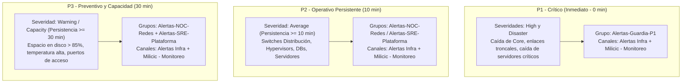

# Modelo de Alertas, Escalamiento y Notificaciones: Zabbix 7.0 LTS (Milicic)

- **Plataforma:** Zabbix Enterprise Monitoring Platform
- **Entorno:** Producción (`prod`)
- **Organización:** Milicic S.A.
- **Canales:** Telegram (`Alertas Infra` y `Milicic - Monitoreo`)

---

## 1. Filosofía del Modelo de Alertas

El sistema de alertas de Milicic está diseñado bajo los principios de **Site Reliability Engineering (SRE)**:
1. **Reducción de fatiga por alertas (*Alert Fatigue*):** No todas las alertas deben despertar a una guardia o generar mensajes instantáneos. Solo los incidentes que afectan la continuidad operativa directa se notifican de inmediato.
2. **Alertas basadas en persistencia (*Time-to-Notify Delay*):** Las alertas de severidad media o preventiva no se notifican en el segundo cero; requieren persistir durante una ventana mínima de tiempo (10 a 30 minutos) para evitar falsos positivos por picos transitorios (ej. backup, reinicio controlado de un servicio).
3. **Ruteo Guiado por Tags (*Tag-Driven Alerting*):** Los destinatarios y los canales se definen mediante tags operacionales en los hosts (`team`, `tier`, `scope`), eliminando la necesidad de tocar o modificar las Acciones cada vez que se agrega un nuevo servidor o switch.

---

## 2. La Pirámide de Criticidad de Alertas



---

## 3. Matriz Detallada de Acciones (*Trigger Actions*)

### 3.1. `TG-P1-Crítico` (Action ID: 8)
* **Objetivo:** Notificación instantánea de caídas mayores que requieren atención urgente de la guardia.
* **Condiciones de Activación:**
  - Severidad del Trigger `>= High` (High o Disaster).
  - El problema **no** está en ventana de mantenimiento (`Problem is not suppressed`).
* **Temporización:** Paso 1 inmediato (`esc_step_from: 1`, `esc_period: 0`).
* **Destinatarios:** Grupo de usuarios `Alertas-Guardia-P1` (`usrgrpid: 15`).
* **Medias Ejecutados:**
  - `Telegram_Test` (71) -> Canal `Alertas Infra` (`-1004383937012`).
  - `Telegram_Test_Milicic` (72) -> Canal `Milicic - Monitoreo` (`-1003912373499`).
* **Plantilla de Mensaje:**
  ```text
  INCIDENTE CRÍTICO
  Host: {HOST.NAME}
  Inicio: {EVENT.DATE} {EVENT.TIME}
  Datos actuales: {EVENT.OPDATA}
  Evento: {EVENT.ID}
  Detalle y reconocimiento:
  https://zabbix.mlccnet.local/tr_events.php?triggerid={TRIGGER.ID}&eventid={EVENT.ID}
  ```

---

### 3.2. `TG-P2-Redes` (Action ID: 9)
* **Objetivo:** Notificación a ingenieros de telecomunicaciones para incidentes en switches, routers y enlaces que persisten más de 10 minutos.
* **Condiciones de Activación:**
  - Severidad del Trigger `= Average`.
  - Tags del Host: `team = redes` Y `tier = core` (o grupos `switch`, `Network`).
  - El problema **no** está suprimido por mantenimiento.
* **Temporización:**
  - **Paso 1 (0 a 10 min):** En silencio. Zabbix espera para descartar microcortes.
  - **Paso 2 (minuto 10):** Se despacha la notificación si el incidente continúa abierto.
* **Destinatarios:** Grupo `Alertas-NOC-Redes` (`usrgrpid: 16`).
* **Medias:** `Telegram_Test` y `Telegram_Test_Milicic`.
* **Plantilla de Mensaje:**
  ```text
  EVENTO PERSISTENTE (10 min)
  Host: {HOST.NAME}
  Inicio: {EVENT.DATE} {EVENT.TIME}
  Datos actuales: {EVENT.OPDATA}
  Evento: {EVENT.ID}
  Detalle y reconocimiento:
  https://zabbix.mlccnet.local/tr_events.php?triggerid={TRIGGER.ID}&eventid={EVENT.ID}
  ```

---

### 3.3. `TG-P2-Plataforma` (Action ID: 10)
* **Objetivo:** Notificación a administradores de infraestructura y DBA para incidentes de servidores, servicios de Windows/Linux, hipervisores y bases de datos.
* **Condiciones de Activación:**
  - Severidad del Trigger `= Average`.
  - Tags del Host: `team = plataforma` O `team = dba` (o grupos `Windows_Server`, `Linux_Server`, `Databases`, `Hypervisors`, `UPS`).
  - El problema **no** está suprimido por mantenimiento.
* **Temporización:** Paso 2 a los **10 minutos** de persistencia.
* **Destinatarios:** Grupo `Alertas-SRE-Plataforma` (`usrgrpid: 17`).
* **Medias:** `Telegram_Test` y `Telegram_Test_Milicic`.

---

### 3.4. `TG-P3-Preventivo` (Action ID: 11)
* **Objetivo:** Notificaciones tempranas de capacidad y degradación para mantenimiento preventivo en horario laboral.
* **Condiciones de Activación:**
  - Severidad `= Warning` Y Tags `scope = capacity` o `scope = notice`.
  - El problema **no** está suprimido por mantenimiento.
* **Temporización:** Paso 2 a los **30 minutos** de persistencia ininterrumpida.
* **Destinatarios:** Grupos `Alertas-NOC-Redes` (16) y `Alertas-SRE-Plataforma` (17).
* **Medias:** `Telegram_Test` y `Telegram_Test_Milicic`.
* **Plantilla de Mensaje:**
  ```text
  EVENTO PERSISTENTE (30 min)
  Host: {HOST.NAME}
  Inicio: {EVENT.DATE} {EVENT.TIME}
  Datos actuales: {EVENT.OPDATA}
  Evento: {EVENT.ID}
  Para SNMP: revisar disponibilidad de recolección, ACL y servicio SNMP; ping no garantiza recepción de métricas.
  Para espacio: revisar capacidad libre y crecimiento; no borrar datos sin validar su función.
  Revisar sensor/ventilación si es temperatura; contrastar NTP del host y de Zabbix si es desfase horario.
  Detalle y reconocimiento:
  https://zabbix.mlccnet.local/tr_events.php?triggerid={TRIGGER.ID}&eventid={EVENT.ID}
  ```

---

## 4. Notificaciones de Recuperación (*Recovery Operations*)

Todas las acciones tienen configurada su contraparte de resolución automática. Cuando un problema se normaliza:
1. Zabbix cancela las operaciones de escalamiento pendientes.
2. Emite de inmediato un mensaje de recuperación con la **duración exacta** del incidente:
   ```text
   EVENTO RECUPERADO
   Host: SRO-SW-CORE01
   Recuperación: 2026.09.18 09:15:20
   Duración: 14m 32s
   Evento: 168851024
   Detalle:
   https://zabbix.mlccnet.local/tr_events.php?triggerid=37601&eventid=168851024
   ```
3. Esto permite a las guardias cerrar el seguimiento de forma transparente sin tener que ingresar a la consola a verificar si el equipo levantó.

---

## 5. Supresión por Ventanas de Mantenimiento

Todas las acciones incluyen la condición:
`Problem is not suppressed` (`conditiontype: 16`, `operator: 11`).

* **Durante un Mantenimiento:**
  - Zabbix **continúa recolectando datos** y graficando métricas.
  - Los problemas se visualizan en la interfaz web con el ícono de llave inglesa naranja.
  - **No se envía ningún mensaje a Telegram**, protegiendo a las guardias y evitando ruido innecesario durante tareas programadas.
