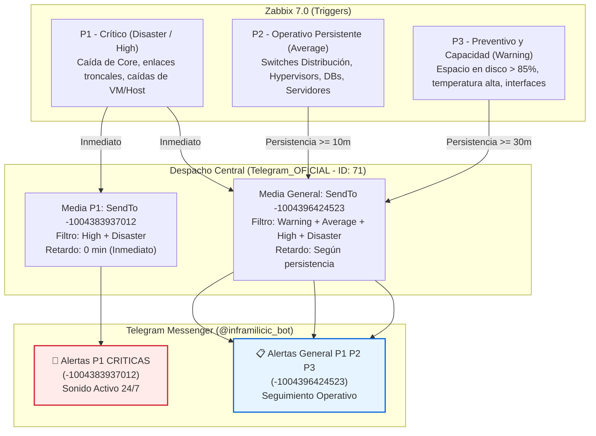

# Modelo de Alertas, Escalamiento y Notificaciones: Zabbix 7.0 LTS (Milicic)

- **Plataforma:** Zabbix Enterprise Monitoring Platform 7.0.22 LTS
- **Entorno:** Producción (`prod` - `https://zabbix.mlccnet.local`)
- **Organización:** Milicic S.A.
- **Bot Oficial:** `@inframilicic_bot` (Media Type: `Telegram_OFICIAL`, ID: 71)
- **Canales Telegram Activos:**
  - `🚨 Alertas P1 CRITICAS` (Chat ID: `-1004383937012`)
  - `📋 Alertas General P1 P2 P3` (Chat ID: `-1004396424523`)

---

## 1. Filosofía del Modelo de Alertas

El sistema de alertas de Milicic está diseñado bajo los principios de **Site Reliability Engineering (SRE)**:
1. **Reducción de fatiga por alertas (*Alert Fatigue*):** No todas las alertas deben despertar a una guardia o generar mensajes instantáneos. Solo los incidentes que afectan la continuidad operativa directa se notifican de inmediato con sonido.
2. **Alertas basadas en persistencia (*Time-to-Notify Delay*):** Las alertas de severidad media o preventiva no se notifican en el segundo cero; requieren persistir durante una ventana mínima de tiempo (10 a 30 minutos) para evitar falsos positivos por picos transitorios (ej. backup, reinicio controlado de un servicio).
3. **Ruteo Unificado con Separación por Criticidad:** Se consolida el despacho en dos grupos operativos:
   - Un canal de **Urgencias P1**, donde solo llegan caídas críticas (High/Disaster) sin retardo y con sonido 24/7.
   - Un canal de **Seguimiento General (P1 + P2 + P3)**, donde conviven todos los eventos persistentes para monitoreo diurno y auditoría en equipo.

---

## 2. La Pirámide de Criticidad y Distribución



---

## 3. Matriz de Severidades, Ventanas de Retardo y Destinos

| Nivel | Severidad Zabbix | Ventana de Retardo | Destino Telegram | Política de Notificación |
| :--- | :--- | :--- | :--- | :--- |
| **P1 - Crítico** | `Disaster`, `High` | **Inmediato (0 min)** | `🚨 Alertas P1 CRITICAS`<br>`📋 Alertas General P1 P2 P3` | Sonido 24/7 activado en P1. Respuesta inmediata del equipo. |
| **P2 - Redes** | `Average` | **10 minutos** (Paso 2) | `📋 Alertas General P1 P2 P3` | En silencio durante 10m para filtrar microcortes. Sin sonido intrusivo. |
| **P2 - Plataforma** | `Average` | **10 minutos** (Paso 2) | `📋 Alertas General P1 P2 P3` | En silencio durante 10m para filtrar reinicios controlados de servicios. |
| **P3 - Preventivo** | `Warning` | **30 minutos** (Paso 2) | `📋 Alertas General P1 P2 P3` | En silencio durante 30m para filtrar picos temporales de CPU o IOPS. |

---

## 4. Matriz Detallada de Acciones en Producción (*Trigger Actions*)

### 4.1. `TG-P1-Crítico` (Action ID: 8)
* **Objetivo:** Notificación instantánea de caídas mayores que requieren atención urgente de la guardia.
* **Condiciones de Activación:**
  - Severidad del Trigger `>= High` (`High` o `Disaster`).
  - Problema no suprimido por mantenimiento (`Problem is not suppressed`).
* **Temporización:** Paso 1 inmediato (`esc_step_from: 1`, `esc_step_to: 1`, `esc_period: 0`).
* **Destinatarios:** Usuario `Admin` vía `Telegram_OFICIAL` (ID: 71).
* **Entrega:** Por filtro de severidad en los Medias, se despacha en paralelo a **ambos grupos** (`Alertas P1 CRITICAS` y `Alertas General P1 P2 P3`).
* **Plantilla de Mensaje:**
  ```text
  INCIDENTE CRÍTICO
  Host: {HOST.NAME}
  Inicio: {EVENT.DATE} {EVENT.TIME}
  Datos actuales: {EVENT.OPDATA}
  Evento: {EVENT.ID}
  Detalle y reconocimiento:
  https://zabbix.mlccnet.local/tr_events.php?triggerid={TRIGGER.ID}&eventid={EVENT.ID}
  ```

---

### 4.2. `TG-P2-Redes` (Action ID: 9)
* **Objetivo:** Notificación a ingenieros de telecomunicaciones para incidentes en switches, routers y enlaces que persisten más de 10 minutos.
* **Condiciones de Activación:**
  - Severidad del Trigger `= Average`.
  - Tags del Host: `team = redes` Y `tier = core` (o grupos `switch`, `Network`).
  - Problema no suprimido por mantenimiento.
* **Temporización:**
  - **Paso 1 (0 a 10 min):** En silencio. Zabbix espera para descartar microcortes.
  - **Paso 2 (minuto 10):** Se despacha la notificación si el incidente continúa abierto.
* **Destinatarios:** Usuario `Admin` vía `Telegram_OFICIAL` (ID: 71).
* **Entrega:** Por filtro de severidad, se despacha **únicamente al grupo `Alertas General P1 P2 P3`**.
* **Plantilla de Mensaje:**
  ```text
  EVENTO PERSISTENTE (10 min)
  Host: {HOST.NAME}
  Inicio: {EVENT.DATE} {EVENT.TIME}
  Datos actuales: {EVENT.OPDATA}
  Evento: {EVENT.ID}
  Detalle y reconocimiento:
  https://zabbix.mlccnet.local/tr_events.php?triggerid={TRIGGER.ID}&eventid={EVENT.ID}
  ```

---

### 4.3. `TG-P2-Plataforma` (Action ID: 10)
* **Objetivo:** Notificación a administradores de infraestructura y DBA para incidentes de servidores, servicios de Windows/Linux, hipervisores y bases de datos.
* **Condiciones de Activación:**
  - Severidad del Trigger `= Average`.
  - Tags del Host: `team = plataforma` O `team = dba` (o grupos `Windows_Server`, `Linux_Server`, `Databases`, `Hypervisors`, `UPS`).
  - Problema no suprimido por mantenimiento.
* **Temporización:** Paso 2 a los **10 minutos** de persistencia ininterrumpida.
* **Destinatarios:** Usuario `Admin` vía `Telegram_OFICIAL` (ID: 71).
* **Entrega:** Despacho **únicamente al grupo `Alertas General P1 P2 P3`**.

---

### 4.4. `TG-P3-Preventivo` (Action ID: 11)
* **Objetivo:** Notificaciones tempranas de capacidad y degradación para mantenimiento preventivo en horario laboral.
* **Condiciones de Activación:**
  - Severidad `= Warning` Y Tags `scope = capacity` o `scope = notice`.
  - Problema no suprimido por mantenimiento.
* **Temporización:** Paso 2 a los **30 minutos** de persistencia ininterrumpida.
* **Destinatarios:** Usuario `Admin` vía `Telegram_OFICIAL` (ID: 71).
* **Entrega:** Despacho **únicamente al grupo `Alertas General P1 P2 P3`**.

---

### 4.5. Acciones de Recordatorio y Especiales
* **`TG-P1-Recordatorios sin reconocimiento` (Action ID: 12):**
  - Recordatorios en Paso 2 (1 hora) y Paso 7 (6 horas) si un evento P1 no fue reconocido por ningún operador.
* **`TG-P2-Plataforma-Recordatorios sin reconocimiento` (Action ID: 14):**
  - Recordatorios en Paso 2 (12 horas) y Paso 3 (24 horas) para eventos P2 persistentes sin acuse de recibo.
* **`TG-P3-MemoryPages-10m-SSJ-HPV01` (Action ID: 15):**
  - Regla específica para métrica de paging memory en el hipervisor de San Juan con 10m de persistencia.

---

## 5. Notificaciones de Recuperación (*Recovery Operations*)

Todas las acciones tienen configurada su contraparte de resolución automática (`Recovery operation`):
1. Zabbix cancela las operaciones de escalamiento pendientes.
2. Emite de inmediato un mensaje de recuperación con la **duración exacta** del incidente:
   ```text
   EVENTO RECUPERADO
   Host: SRO-SW-CORE01
   Recuperación: 2026.09.26 09:15:20
   Duración: 14m 32s
   Evento: 168851024
   Detalle:
   https://zabbix.mlccnet.local/tr_events.php?triggerid=37601&eventid=168851024
   ```
3. Si el incidente era P1, la recuperación llega a **ambos grupos**. Si era P2 o P3, llega **únicamente al grupo General**.

---

## 6. Supresión por Ventanas de Mantenimiento

Todas las acciones incluyen la condición mandatoria:
`Problem is not suppressed` (`conditiontype: 16`, `operator: 11`).

* **Durante un Mantenimiento Programado:**
  - Zabbix **continúa recolectando datos** y graficando métricas.
  - Los problemas se visualizan en la interfaz web con el ícono de llave inglesa naranja.
  - **No se envía ningún mensaje a Telegram**, protegiendo a las guardias y eliminando ruido durante intervenciones acordadas.
