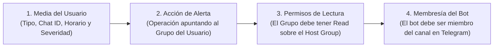

# Guía de Administración: Gestión de Usuarios, Permisos y Notificaciones (Telegram)

- **Plataforma:** Zabbix Enterprise Monitoring Platform
- **Entorno:** Producción (`prod` - `https://zabbix.mlccnet.local`)
- **Público:** Administradores de Zabbix y Líderes de Infraestructura
- **Organización:** Milicic S.A.

---

## 1. Los 4 Eslabones Obligatorios para Recibir Alertas

> [!CAUTION]
> **En Zabbix, agregar un medio de Telegram en el usuario NO ES SUFICIENTE por sí solo.**
> Para que un operador reciba mensajes en Telegram, deben cumplirse obligatoriamente estos 4 eslabones:

Si cualquiera de estos 4 eslabones falla, la alerta **no llegará**:
* Si falla el 1 o el 2: Zabbix muestra en el log de alertas `No media defined for user`.
* Si falla el 3: Zabbix **descarta la alerta silenciosamente** sin emitir error.
* Si falla el 4: Telegram rechaza la entrega con `Bad Request: chat not found` o `Forbidden`.

---

## 2. Paso a Paso: Alta de un Nuevo Usuario Operador

### Paso 1: Crear la Cuenta de Usuario
1. Vaya a `Users -> Users -> Create user`.
2. Pestaña **User**:
   - **Username:** Convención corporativa (ej. `jdoe.zabbix`).
   - **Name:** Nombre de pila.
   - **Surname:** Apellido.
   - **Groups:** Asigne como mínimo los grupos de visualización y de alerta que correspondan:
     - `Viewers` (para acceso de lectura web a dashboards).
     - Y según su rol: `Alertas-Guardia-P1` (15), `Alertas-NOC-Redes` (16) o `Alertas-SRE-Plataforma` (17).
   - **Password:** Contraseña segura inicial.
3. Pestaña **Permissions**:
   - **Role:** Asigne `User role` o `Admin role` según las responsabilidades requeridas.

---

### Paso 2: Configurar el Canal de Notificación (Media)

En la pestaña **Media**, haga clic en **Add**:

* **Type:** Seleccione el Media Type según el destino:
  - `Telegram_Test` (si debe emitir al canal de Infraestructura).
  - `Telegram_Test_Milicic` (si debe emitir al canal corporativo *Milicic - Monitoreo*).
* **Send to:** El Chat ID de Telegram:
  - Para un **Canal o Supergrupo**: El número siempre es negativo y comienza con `-100` (ej: `-1003912373499` o `-1004383937012`).
  - Para un **Chat Personal**: El Chat ID numérico individual (ej: `123456789`).
* **When active:** Horario de disponibilidad (ej. `1-7,00:00-24:00` para 24/7, o `1-5,08:00-18:00` para días hábiles).
* **Use if severity:** Marque las severidades deseadas:
  - Para guardias P1: Marcar `High` y `Disaster`.
  - Para monitoreo general: Marcar `Warning`, `Average`, `High` y `Disaster` (o todas).
* **Status:** Asegúrese de que la casilla **Enabled** esté marcada.
* Haga clic en **Add** en la ventana flotante y luego en **Update** en la ficha del usuario.

---

### Paso 3: Validar los Permisos de Lectura sobre los Hosts

> [!IMPORTANT]
> **El Filtro Silencioso de Zabbix:**
> Aunque un usuario pertenezca a un grupo al que la Acción le envía alertas, si su grupo de usuarios no tiene permiso de **Lectura (Read)** o **Lectura/Escritura (Read-write)** sobre el Host Group donde ocurrió el incidente, Zabbix descarta el envío sin dejar trazas de error.

Para verificar los permisos:
1. Vaya a `Users -> User groups`.
2. Abra el grupo del usuario (ej: `Alertas-Guardia-P1`).
3. En la pestaña **Host permissions**, verifique que los grupos principales (`switch`, `Network`, `Windows_Server`, `Linux_Server`, `Databases`, `Hypervisors`, `FortiGate`) figuren en estado **Read**.

---

### Paso 4: Validar la Membresía del Bot en Telegram

Si el destino configurado es un grupo o canal:
1. Abra el grupo en la aplicación de Telegram.
2. Verifique que el bot emisor sea miembro del grupo:
   - Para `Telegram_Test`: el bot es **`@inframilicic_bot`**.
   - Para `Telegram_Test_Milicic`: el bot es **`@Milicic_bot`**.
3. **Privilegios:** Si es un canal, el bot debe ser añadido como **Administrador** con permiso de *Publicar mensajes*.

Si el destino es un chat personal privado:
- El usuario **debe haber abierto el chat con el bot y presionado `/start` previamente**. Los bots de Telegram tienen prohibido por protocolo iniciar conversaciones privadas con usuarios que no los hayan iniciado antes.

---

## 3. Matriz de Medias Configurados en Producción

| Media Type | ID | Bot | Chat ID Destino | Canal / Grupo | Finalidad |
| :--- | :--- | :--- | :--- | :--- | :--- |
| **`Telegram_Test`** | 71 | `@inframilicic_bot` | **`-1004383937012`** | **Alertas Infra** | Alertas operativas para la guardia y administración. |
| **`Telegram_Test_Milicic`** | 72 | `@Milicic_bot` | **`-1003912373499`** | **Milicic - Monitoreo** | Canal institucional transversal para seguimiento general. |

---

## 4. Guía de Solución de Problemas (Troubleshooting)

Si un usuario o canal reporta no estar recibiendo alertas:

### Diagnóstico en Zabbix:
1. Vaya a `Alerts -> Actions / Alert log` en el menú principal.
2. Filtre por las últimas horas.
3. Analice la columna **Status** y **Error**:

| Error en el Log | Causa Raíz | Solución |
| :--- | :--- | :--- |
| `Sending failed: Bad Request: chat not found` | El bot no fue agregado al grupo de Telegram, o el Chat ID no lleva el prefijo `-100`. | Añadir al bot (`@Milicic_bot` o `@inframilicic_bot`) como admin del canal y verificar que el ID empiece con `-100`. |
| `No media defined for user` | El usuario no tiene configurado el Media Type específico que la Acción está despachando, o está fuera del horario `When active`. | En el usuario, agregar el Media correspondiente (`Telegram_Test` o `Telegram_Test_Milicic`) y verificar que el horario cubra el momento del evento. |
| La alerta no aparece en el log para ese usuario | El usuario no tiene permisos de lectura (`Read`) sobre el host que falló. | Ir a `Users -> User groups -> [Grupo] -> Host permissions` y otorgar permiso `Read` sobre el grupo del host. |
| `Status: In progress / 0 retries` | El alerter de Zabbix está intentando el envío. | Aguardar unos segundos y refrescar el log. |
| `Status: Sent` | Mensaje entregado con éxito por Telegram. | El mensaje ya se encuentra publicado en el canal correspondiente. |
