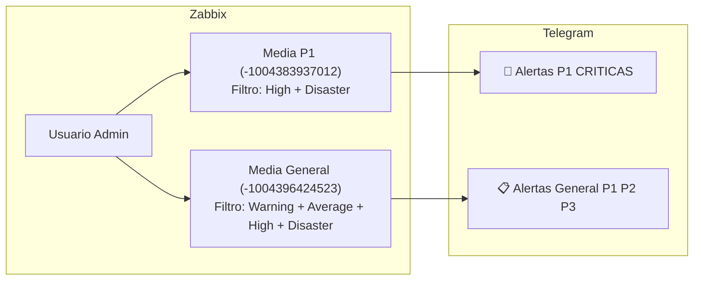

# Canales de Notificación en Telegram - Configuración y Diagnóstico

Este manual describe el funcionamiento de los canales de notificación en Telegram integrados con Zabbix en Milicic S.A., la arquitectura de 2 grupos con bot unificado, y la resolución de incidentes de entrega (como el error `Bad Request: chat not found`).

---

## 1. Inventario de Bots y Medios en Producción

Milicic opera con un único bot oficial para toda la plataforma de monitoreo:

| Tipo de Medio (Media Type) | ID Zabbix | Nombre del Bot | Username en Telegram | Destinos Principales | Estado |
| :--- | :---: | :--- | :--- | :--- | :---: |
| **`Telegram_OFICIAL`** | `71` | Alertas Infra MILICIC | `@inframilicic_bot` | `🚨 Alertas P1 CRITICAS` (`-1004383937012`)<br>`📋 Alertas General P1 P2 P3` (`-1004396424523`) | **Habilitado** (`status: 0`) |
| **`Telegram_Test_Milicic`** | `72` | Zbx_milicic_group | `@Milicic_bot` | Canal legacy deshabilitado | Deshabilitado (`status: 1`) |
| **`Telegram_1`** | `70` | Zbx_milicic_group | `@Milicic_bot` | Canal legacy deshabilitado | Deshabilitado (Legacy) |

---

## 2. Anatomía del Error: "Bad Request: chat not found"

En el log de alertas de Zabbix (`alert.get`), el error `Sending failed: Bad Request: chat not found` ocurre por dos causas raíz técnicas:

1. **El Bot no es Miembro o Administrador del Grupo:**
   - La API de Telegram no permite que un bot envíe mensajes a un grupo en el que no fue agregado previamente.
   - Si se configura un Chat ID en Zabbix pero el bot (`@inframilicic_bot`) no está en el grupo, Telegram rechaza la petición con HTTP 400.
2. **Falta del Prefijo `-100` en Supergrupos:**
   - En Telegram, al migrar un grupo a supergrupo (habilitar historial, temas o superar miembros), el ID se convierte en un número negativo que **siempre comienza con `-100`** (ej. `-1004396424523`).
   - Si se omite el `-100` y se ingresa `-4396424523`, la API devuelve inmediatamente `chat not found`.

---

## 3. Arquitectura de Despacho en 2 Grupos

Para evitar la duplicación de mensajes y permitir que el mismo equipo atienda toda la infraestructura sin saturarse:



- **Grupo 1: `🚨 Alertas P1 CRITICAS` (`-1004383937012`):**
  - Recibe caídas de core, hipervisores, bases de datos caídas y storage.
  - Notificación inmediata (0 min). Sonido prioritario 24/7.
- **Grupo 2: `📋 Alertas General P1 P2 P3` (`-1004396424523`):**
  - Recibe todos los eventos (P1 inmediato, P2 tras 10 min de persistencia, P3 tras 30 min de persistencia).
  - Notificación silenciada (*Mute*) para consulta y bitácora diurna.

---

## 4. Procedimiento para Vincular Nuevos Canales o Grupos

### Paso 1: Agregar el Bot al Grupo
1. En Telegram, abrir el grupo objetivo.
2. Ir a la información del grupo → **Añadir miembros**.
3. Buscar y agregar a **`@inframilicic_bot`**.
4. Ir a **Administradores** → **Añadir Administrador** y concederle permiso de **Publicar mensajes** (*Post Messages*).

### Paso 2: Obtener el Chat ID Exacto
1. Enviar una palabra en el grupo (ej. `test`).
2. Consultar el webhook del bot vía navegador o PowerShell:
   ```text
   https://api.telegram.org/bot<TOKEN>/getUpdates
   ```
3. Buscar el bloque `"chat"` y copiar el `"id"` (ej. `-1004396424523`).

### Paso 3: Asignar en Zabbix
1. Ir a **Users** → **Users** → Seleccionar el usuario de despacho (`Admin` o `mlarenti.zabbix`).
2. En la pestaña **Media**, agregar el tipo `Telegram_OFICIAL` con el Chat ID obtenido.
3. Configurar el filtro de severidad correspondiente.

---

## 5. Tabla de Diagnóstico de Errores

| Error en Alert Log | Causa Raíz | Solución |
| :--- | :--- | :--- |
| `Bad Request: chat not found` | El bot no está en el grupo o falta el prefijo `-100`. | Añadir `@inframilicic_bot` como admin y verificar el ID con `-100`. |
| `Forbidden: bot was blocked by the user` | Un usuario personal bloqueó al bot. | Enviar `/start` al bot en chat privado. |
| `Forbidden: bot is not a member` | El canal no tiene al bot como administrador. | Asignar rol de Administrador al bot en el canal. |
| `No media defined for user` | El usuario del grupo no tiene configurada la solapa Media. | Ir a `Users -> Users -> Media` y cargar el Media Type. |
| `Connection timed out` | Sin salida HTTPS saliente al puerto 443 hacia `api.telegram.org`. | Verificar conectividad saliente en el host Linux `172.30.20.61`. |
