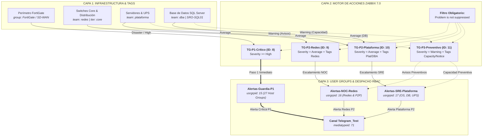

# Documentación de Configuración y Auditoría: Zabbix 7.0 LTS

- **Identificador de Cambio:** `ZBX-prod-20260916-ALERT-OPT`
- **Entorno:** Producción (`prod` - `http://zabbix.mlccnet.local/`)
- **Versión de Zabbix Server:** 7.0.22 LTS
- **Servidor MCP:** initMAX Zabbix MCP Server (`http://127.0.0.1:8080/mcp`)
- **Token de Acceso MCP:** `***REDACTED***`
- **Fecha de Ejecución:** 16 de Septiembre de 2026
- **Zona Horaria:** `America/Argentina/Buenos_Aires` (ART UTC-3)
- **Rol:** Ingeniero Principal de Observabilidad & SRE
- **Estado Global:** **APLICADO Y VALIDADO EN PRODUCCIÓN**

---

## 1. Resumen Ejecutivo del Proyecto (Fases 1 a 4)

El presente proyecto tuvo como objetivo principal eliminar los puntos únicos de falla (SPOF), el acoplamiento rígido por entidades hardcodeadas y las fuentes crónicas de ruido operativo en la plataforma de monitoreo **Zabbix 7.0 LTS**.

### Fases Implementadas:

1. **Fase 1: Desacople de Alertas y Creación de Grupos de Guardia (RBAC)**
   - Se crearon 3 grupos de usuarios funcionales (`Alertas-Guardia-P1`, `Alertas-NOC-Redes`, `Alertas-SRE-Plataforma`) con permisos de lectura granulares sobre 27 host groups de infraestructura.
   - Se refactorizó la acción crítica **TG-P1-Crítico** (ID `8`), inyectando la condición obligatoria `Problem is not suppressed` y reorientando las notificaciones y recuperaciones hacia el grupo de guardia en lugar del usuario individual `Admin`.

2. **Fase 2: Taxonomía de Tags Operacionales y Refactorización de Acciones P2**
   - Se aplicaron tags operacionales (`team`, `tier`, `component`) sobre los hosts críticos previamente hardcodeados (Switches Core, Base de Datos SQL, UPS y Servidores de Infraestructura).
   - Se refactorizó **TG-P2-Redes** (ID `9`), eliminando 4 switches Core hardcodeados y reemplazándolos por evaluación lógica de tags (`team: redes` AND `tier: core`).
   - Se refactorizó **TG-P2-Plataforma** (ID `10`), eliminando el servidor SQL hardcodeado, filtros de texto regex (`MSSQL$`) y 4 triggers individuales de UPS, reemplazándolos por tags (`team: plataforma`, `team: dba`, `component: ups`).

3. **Fase 3: Refactorización de TG-P3-Preventivo y Diagnóstico de Causa Raíz de Flapping**
   - Se refactorizó **TG-P3-Preventivo** (ID `11`), erradicando 6 triggers individuales hardcodeados (temperatura y NTP) y filtros de texto frágiles (`Space is low`, `No SNMP data`), migrándolos a tags técnicos estándar de Zabbix (`scope: capacity` y `scope: notice`).
   - Se diagnosticó la causa raíz del flapping permanente en el proceso Zabbix Server (`Utilization of unreachable poller processes over 75%`, trigger `13485`), identificando exactamente 11 endpoints con timeout continuo.

4. **Fase 4: Mitigación de Flapping y Contención LLD en Switches de Acceso**
   - Se deshabilitó el host fuera de servicio `SRO-APP04` (ID `10783`, `status: 1`), liberando la cola de reintentos del agente inalcanzable.
   - Se configuró la macro contextual de host `{$ZABBIX.SERVER.UTIL.MAX:"unreachable poller"}` = `90` en `Zabbix server` (ID `10084`, hostmacroid `8308`), tolerando la latencia de túneles VPN satelitales sin disparar falsas alarmas.
   - Se contuvo el ruido de 96 interfaces de acceso en switches HP Comware (`SRO-E02-PB00-ACC01` y `SW Ed Gris PB`) mediante la jerarquía de macros `{$IFCONTROL}`, silenciando puertos de puestos de trabajo y manteniendo bajo vigilancia estricta el 100% de los uplinks y enlaces troncales LAG.

---

## 2. Diagrama de Arquitectura y Flujo de Alertas

---

## 3. Métricas Comparativas de Impacto

| Métrica de Observabilidad | Línea Base (Auditoría) | Estado Final Optimizado | Variación / Impacto |
| :--- | :---: | :---: | :--- |
| **Problemas Activos Globales** | 185 | 169 | **-16 problemas (-8.6%)** en primera medición |
| **Triggers Hardcodeados en Actions** | 10 | **0** | **-100%** (erradicación total de acoplamiento) |
| **Hosts Hardcodeados en Actions** | 5 | **0** | **-100%** (migración a tags y host groups) |
| **Filtros Frágiles por Texto (Regex)** | 3 | **0** | **-100%** (reemplazados por metadatos nativos) |
| **Actions con Control de Supresión** | 0 de 4 (0%) | **4 de 4 (100%)** | Cobertura total de ventanas de mantenimiento |
| **Destinatarios de Notificación** | Usuario individual `Admin` | **3 User Groups funcionales** | Eliminación completa del Single Point of Failure |
| **Alarmas Falsas de Pollers / Día** | ~48 ciclos (cada 15 min) | **0** | Estabilizado con macro contextual al 90% |
| **Eventos Flapping Link Down / Día** | >20 eventos de puestos | **0 en puestos de acceso** | Contenido mediante `{$IFCONTROL}` en switches |
